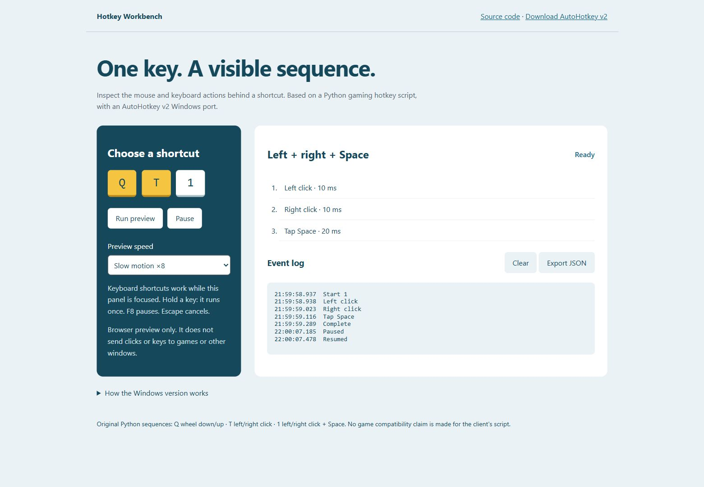

<div align="center">

# Hotkey Workbench

Secuencias de teclado y ratón para Windows, con una vista previa que permite observar cada acción antes de ejecutarla.

<a href="#iniciar-la-demo"></a>

<p>
<a href="https://github.com/Enybyy/hotkey-workbench"></a>
<a href="https://www.upwork.com/freelancers/~01471ca462b236e8e5?p=2105780771181342720"></a>
</p>



*La captura muestra la secuencia 1 y su registro real en la demo del navegador.*

[El proyecto](#del-atajo-al-control) · [Cómo funciona](#una-secuencia-a-la-vista) · [Windows](#usarlo-en-windows) · [Verificación](#comprobaciones)

</div>

## Iniciar la demo

La vista previa funciona sin instalar Python ni AutoHotkey:

1. [Descarga index.html](https://raw.githubusercontent.com/Enybyy/hotkey-workbench/main/index.html) y guárdalo como archivo HTML.
2. Ábrelo en tu navegador.
3. Elige **Q**, **T** o **1** y pulsa **Run preview**. Prueba la cámara lenta, pausa la ejecución o exporta el registro a JSON.

El archivo es autocontenido. El alojamiento en GitHub Pages todavía está pendiente; por ahora, el botón principal lleva a estas instrucciones.

La demo representa las acciones dentro de la página. No envía clics ni teclas al juego o a otras ventanas.

## Del atajo al control

El proyecto comenzó como un script personal de Python para Left 4 Dead 2: una tecla disparaba una pequeña secuencia de movimientos de rueda, clics o barra espaciadora.

Cuando estas acciones se encadenan con pausas cortas, ya no basta con saber qué tecla las inicia. También importa que no se solapen, que puedan detenerse y que no continúen después de cambiar de ventana. Esa necesidad dio lugar a una versión más clara del script, un port a AutoHotkey v2 y un espacio donde revisar cada paso sin entrar al juego.

La implementación conserva las tres secuencias originales y corrige la diferencia entre el atajo anunciado como `1` y su antigua asignación a `|`. La salida del programa también se reorganizó para detener el listener principal.

## Una secuencia a la vista

Selecciona un atajo y observa sus acciones en orden. La línea de tiempo muestra las pausas solicitadas y el registro permite revisar qué ocurrió durante la ejecución.

| Atajo | Acciones | Pausas solicitadas |
| --- | --- | --- |
| **Q** | Rueda abajo 2 → rueda arriba 2 | 31 / 32 ms |
| **T** | Clic izquierdo → clic derecho | 100 ms |
| **1** | Clic izquierdo → clic derecho → Espacio | 10 / 10 / 20 ms |

En Windows, el motor comprueba el estado de pausa y la ventana de destino antes de enviar cada paso. El estado de ejecución impide secuencias simultáneas; la pausa, el cambio de modo o la pérdida de foco cancelan los pasos pendientes.

Mantener una tecla presionada inicia una sola secuencia. Los tiempos son pausas solicitadas al sistema operativo: no representan una garantía de precisión al milisegundo.

## Usarlo en Windows

Instala [AutoHotkey v2](https://www.autohotkey.com/), descarga [HotkeyWorkbench.ahk](HotkeyWorkbench.ahk) y ábrelo.

El panel empieza en **vista previa**: registra las acciones sin enviarlas. Los botones del panel siempre previsualizan. Para activar el perfil original, desmarca la vista previa y coloca `left4dead2.exe` en primer plano.

| Control | Qué hace |
| --- | --- |
| **F8** | Pausa o reanuda desde el panel o el juego de destino |
| **Alt+F5** | Cierra el programa desde el panel o el juego de destino |
| **Cerrar el panel** | Termina el proceso |
| **Cambiar de ventana** | Cancela los pasos pendientes de una secuencia en vivo |

Los atajos de AutoHotkey quedan limitados al panel y a la ventana configurada. En las demás aplicaciones mantienen su comportamiento habitual.

<details>
<summary><strong>También disponible en Python</strong></summary>

La demostración de consola solo requiere la biblioteca estándar:

```powershell
python hotkeys.py --demo 1
```

Para escuchar los atajos originales con pynput:

```powershell
python -m pip install -r requirements.txt
python hotkeys.py --live
```

La versión Python comprueba el título de la ventana activa y no bloquea la tecla original. La versión AutoHotkey comprueba el ejecutable e intercepta los atajos del perfil activo.

</details>

<details>
<summary><strong>Adaptar el perfil a otra aplicación</strong></summary>

Modifica `Target` y `Sequences` en el archivo AutoHotkey. Antes de trabajar sobre un script existente, comprueba si utiliza AutoHotkey v1 o v2: su sintaxis es distinta.

El perfil usa secuencias finitas y debe probarse en el entorno de destino. Utilízalo donde la automatización de entrada esté permitida.

</details>

## Comprobaciones

Se verificaron el orden de acciones, la asignación de `1`, la cancelación, la pérdida de foco, el cooldown y el bloqueo de ejecuciones simultáneas mediante cinco pruebas de Python.

AutoHotkey v2.0.28 cargó el script completo sin errores y verificó su configuración. La demo web se probó con la secuencia de tres acciones, pausa y reanudación; también se revisó su presentación en una ventana estrecha.

```powershell
python -m unittest discover -s tests -v
AutoHotkey64.exe /ErrorStdOut HotkeyWorkbench.ahk --self-test
```

La comprobación de AutoHotkey valida la carga y configuración, no todas las rutas de ejecución en vivo. La compatibilidad dentro del juego sigue pendiente. Los detalles están en [las notas de verificación](docs/VERIFICATION.md).

## Más fácil de revisar, ajustar y mantener

Las acciones y sus pausas quedan declaradas en un solo lugar. El registro permite seguir una secuencia sin adivinar qué paso se ejecutó, y los controles de pausa y cancelación facilitan probar cambios de forma gradual.

La vista previa da un punto de partida compartido para explicar un ajuste: primero se observa la secuencia, después se modifica y finalmente se comprueba en la aplicación de destino.

---

<div align="center">

**Eliud Rojas Mendoza · Enybyy**

<p>
<a href="https://github.com/Enybyy"></a>
<a href="https://www.upwork.com/freelancers/~01471ca462b236e8e5"></a>
</p>

</div>

